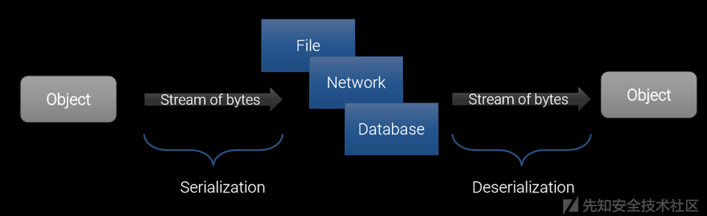

# 反序列化漏洞

序列化：把对象转换为字节序列的过程。

反序列化：把字节序列恢复为对象的过程。**用途：**

1） 把对象的字节序列永久地保存到硬盘上，通常存放在一个文件中；  
2） 在网络上传送对象的字节序列。

**应用场景：**

1\) 一般来说，服务器启动后，就不会再关闭了，但是如果逼不得已需要重启，而用户会话还在进行相应的操作，这时就需要使用序列化将session信息保存起来放在硬盘，服务器重启后，又重新加载。这样就保证了用户信息不会丢失，实现永久化保存。

2\) 在很多应用中，需要对某些对象进行序列化，让它们离开内存空间，入住物理硬盘，以便减轻内存压力或便于长期保存。

比如最常见的是Web服务器中的Session对象，当有 10万用户并发访问，就有可能出现10万个Session对象，内存可能吃不消，于是Web容器就会把一些seesion先序列化到硬盘中，等要用了，再把保存在硬盘中的对象还原到内存中。

例子： 淘宝每年都会有定时抢购的活动，很多用户会提前登录等待，长时间不进行操作，一致保存在内存中，而到达指定时刻，几十万用户并发访问，就可能会有几十万个session，内存可能吃不消。这时就需要进行对象的活化、钝化，让其在闲置的时候离开内存，将信息保存至硬盘，等要用的时候，就重新加载进内存。

## 0x01.1 关键api

```text
    java.io.ObjectOutputStream代表对象输出流，它的writeObject\(Object obj\)方法可对参数指定的obj对象进行序列化，把得到的字节序列写到一个目标输出流中。

    java.io.ObjectInputStream代表对象输入流，它的readObject\(\)方法从一个源输入流中读取字节序列，再把它们反序列化为一个对象，并将其返回。
```

**漏洞是怎么来的呢？**

我们既然已经知道了序列化与反序列化的过程，那么如果反序列化的时候，这些即将被反序列化的数据是我们特殊构造的呢！

如果Java应用对用户输入，即不可信数据做了反序列化处理，那么攻击者可以通过构造恶意输入，让反序列化产生非预期的对象，非预期的对象在产生过程中就有可能带来任意代码执行。

## [Java反序列化漏洞分析](https://xz.aliyun.com/t/136)     这一篇比较基础，没有基础可以先看这篇

## [Java序列化和反序列化](https://xz.aliyun.com/t/1825)

## [java反序列化漏洞从入门到深入](https://xz.aliyun.com/t/2041#toc-6)

## [先知议题解读 \| Java反序列化实战](https://www.anquanke.com/post/id/148593)

## [深入理解JAVA反序列化漏洞](https://www.vulbox.com/knowledge/detail/?id=11)   漏洞盒子的一篇

