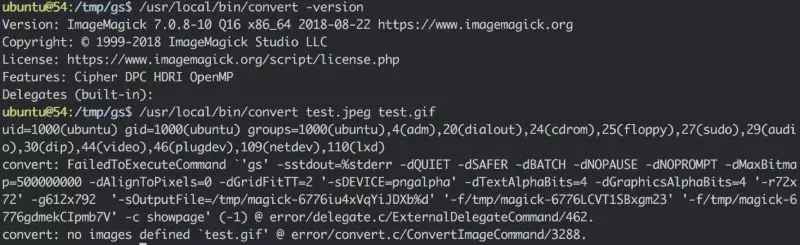

# GhostScript 沙箱绕过  （命令执行）漏洞

## 事件来源

8 月 21 号，Tavis Ormandy 通过公开邮件列表，再次指出 GhostScript 的安全沙箱可以被绕过，通过构造恶意的图片内容，将可以造成命令执行、文件读取、文件删除等漏洞：

[http://seclists.org/oss-sec/2018/q3/142](http://seclists.org/oss-sec/2018/q3/142)

GhostScript 被许多图片处理库所使用，如 ImageMagick、Python PIL 等，默认情况下这些库会根据图片的内容将其分发给不同的处理方法，其中就包括 GhostScript。

ImageMagick 是一款广泛使用的图像处理软件，有相当多的网站使用它来进行图像处理。它被许多编程语言所支持，包括 Perl，C++，PHP，Python 和 Ruby 等，并被部署在数以百万计的网站，博客，社交媒体平台和流行的内容管理系统（CMS），例如 WordPress 和 Drupal。

Python PIL 是 Python 语言中处理图片的第三方模块。

## 漏洞描述

此漏洞导致攻击者可以通过上传恶意构造的图像文件，当目标服务器在对图像进行图像裁剪、转换等处理时即会执行攻击者指定的命令。



其实 ImageMagick 在 2016 年时就曾出现类似的命令执行漏洞（CVE-2016-3714），也是由于 GhostScript 沙盒绕过导致的安全问题。当时就导致国内诸多厂商及开源程序中招，并且许多厂商因此遭受严重损失。

## 影响范围

使用 GhostScript、ImageMagick 等对来源由用户可控的图像数据进行图像处理的网站和程序。

## 解决方案

由于目前官方尚未发布补丁，可以使用以下临时解决方案其中一个：

1.卸载 GhostScript

以 Ubuntu 系统为例，执行以下命令以卸载 GhostScript：

sudo apt-get remove ghostscript

2.修改 ImageMagick 的 policy 文件，默认位置为 /etc/ImageMagick/policy.xml，在 &lt;policymap&gt; 中加入以下 &lt;policy&gt;（即禁用 PS、EPS、PDF、XPS coders）：

```text
<policymap>

  <policy domain="coder" rights="none" pattern="PS" />

  <policy domain="coder" rights="none" pattern="EPS" />

  <policy domain="coder" rights="none" pattern="PDF" />

  <policy domain="coder" rights="none" pattern="XPS" />

</policymap>
```

