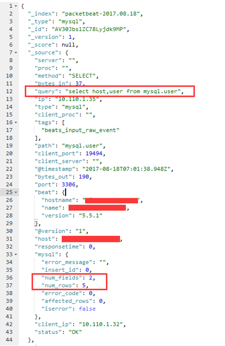

# 【企业安全实战】数据库审计部署实践

原文链接：[http://vinc.top/2017/08/16/%E3%80%90%E4%BC%81%E4%B8%9A%E5%AE%89%E5%85%A8%E5%AE%9E%E6%88%98%E3%80%91%E6%95%B0%E6%8D%AE%E5%BA%93%E5%AE%A1%E8%AE%A1%E9%83%A8%E7%BD%B2%E5%AE%9E%E8%B7%B5/](http://vinc.top/2017/08/16/【企业安全实战】数据库审计部署实践/)

**0x01 概述**

安全的核心是数据，数据库安全也是企业安全中很重要的一点，当然数据库安全涉及到很多方面，又衍生出很多安全产品，例如数据库审计、数据库防火墙、数据库加密、数据库脱敏等，本文主要阐述企业内部Mysql DB审计记录SQL执行的实现。按照部署方式分为以下几种：

1）流量镜像

旁路部署，透明部署，不影响网络拓扑，也不会造成额外的性能消耗。

2）DB Proxy

很多公司都有Mysql中间件，用于读写分离、负载均衡、监控等等。

3）DB Server部署Agent

在每台DB Server上安装Agent获取DB流量。

4）DB审计插件

安装插件记录增删改查语句，然后采集生成日志。

这里我们介绍一下比较流行的分析工具和插件。

## **0x02 DB审计插件**

### **1、Mariadb Audit插件**

从Mariadb 10.0版本开始audit插件直接内嵌了，名称为server\_audit.so，可以直接加载使用。配置过程如下：

配置yum 数据源：

```text
cd /etc/yum.repos.d/ 

vim /etc/yum.repos.d/MariaDB.repo
```

写入以下内容：

```text
# MariaDB 10.0 CentOS repository list - created 2015-08-12 10:59 UTC 

# http://mariadb.org/mariadb/repositories/ 

[mariadb] 

name = MariaDB 

baseurl = http://yum.mariadb.org/10.0/centos6-amd64 

gpgkey=https://yum.mariadb.org/RPM-GPG-KEY-MariaDB 

gpgcheck=1
```

安装数据库：

```text
yum -y install MariaDB-server MariaDB-client
```

启动数据库：

```text
service mysql start
```

设置root密码：

```text
mysqladmin -u root -p password 'hehe123'
```

```text
安装审计插件：

MariaDB [(none)]> install plugin server_audit soname 'server_audit.so';

Query OK, 0 rows affected (0.00 sec)

MariaDB [(none)]> show variables like '%audit%';

+-------------------------------+-----------------------+

| Variable_name                 | Value                 |

+-------------------------------+-----------------------+

| server_audit_events           |                       |

| server_audit_excl_users       |                       |

| server_audit_file_path        | server_audit.log      |

| server_audit_file_rotate_now  | OFF                   |

| server_audit_file_rotate_size | 1000000               |

| server_audit_file_rotations   | 9                     |

| server_audit_incl_users       |                       |

| server_audit_logging          | OFF                   |

| server_audit_mode             | 0                     |

| server_audit_output_type      | file                  |

| server_audit_query_log_limit  | 1024                  |

| server_audit_syslog_facility  | LOG_USER              |

| server_audit_syslog_ident     | mysql-server_auditing |

| server_audit_syslog_info      |                       |

| server_audit_syslog_priority  | LOG_INFO              |

+-------------------------------+-----------------------+

15 rows in set (0.00 sec)
```

参数说明：

server\_audit\_output\_type：指定日志输出类型，可为SYSLOG或FILE

server\_audit\_logging：启动或关闭审计

server\_audit\_events：指定记录事件的类型，可以用逗号分隔的多个值\(connect,query,table\)，如果开启了查询缓存\(query cache\)，查询直接从查询缓存返回数据，将没有table记录

server\_audit\_file\_path：如server\_audit\_output\_type为FILE，使用该变量设置存储日志的文件，可以指定目录，默认存放在数据目录的server\_audit.log文件中

server\_audit\_file\_rotate\_size：限制日志文件的大小

server\_audit\_file\_rotations：指定日志文件的数量，如果为0日志将从不轮转

server\_audit\_file\_rotate\_now：强制日志文件轮转

server\_audit\_incl\_users：指定哪些用户的活动将记录，connect将不受此变量影响，该变量比server\_audit\_excl\_users 优先级高

server\_audit\_syslog\_facility：默认为LOG\_USER，指定facility

server\_audit\_syslog\_ident：设置ident，作为每个syslog记录的一部分

server\_audit\_syslog\_info：指定的info字符串将添加到syslog记录

server\_audit\_syslog\_priority：定义记录日志的syslogd priority

server\_audit\_excl\_users：该列表的用户行为将不记录，connect将不受该设置影响

server\_audit\_mode：标识版本，用于开发测试

vim /etc/my.cnf.d/server.cnf

在\[server\]下添加：

```text
server_audit_events='CONNECT,QUERY,TABLE'

server_audit_logging=ON     

server_audit_file_rotate_size = 10G   

server_audit_file_path='/tmp/server_audit.log'
```

执行数据库操作，审计到的内容如下：

```text
20170307 08:39:55,kafka112,root,localhost,3,67,READ,test,test,

20170307 08:39:55,kafka112,root,localhost,3,67,QUERY,test,'select * from test',0

20170307 08:40:29,kafka112,root,localhost,3,0,DISCONNECT,test,,0

20170307 08:41:06,kafka112,root,localhost,4,0,FAILED_CONNECT,,,1045

20170307 08:41:06,kafka112,root,localhost,4,0,DISCONNECT,,,0

20170307 08:41:11,kafka112,root,localhost,5,0,CONNECT,,,0

20170307 08:41:11,kafka112,root,localhost,5,69,QUERY,,'select @@version_comment limit 1',0

20170307 08:41:22,kafka112,root,localhost,5,70,QUERY,,'show variables like \'%audit%\'',0
```

**2、Mysql audit plugin**

Mysql audit plugin是Mcafee开源的Mysql审计工具，支持版本为MySQL \(5.1, 5.5, 5.6, 5.7\)，MariaDB \(5.5, 10.0, 10.1\) ，Platform \(32 or 64 bit\)。

插件地址如下：

[https://bintray.com/mcafee/mysql-audit-plugin/release](https://bintray.com/mcafee/mysql-audit-plugin/release)

根据Mysql版本下载配对的版本插件。

[https://bintray.com/mcafee/mysql-audit-plugin/release/1.1.4-725?versionPath=%2Fmcafee%2Fmysql-audit-plugin%2Frelease%2F1.1.4-725\#files](https://bintray.com/mcafee/mysql-audit-plugin/release/1.1.4-725?versionPath=%2Fmcafee%2Fmysql-audit-plugin%2Frelease%2F1.1.4-725#files)

下载解压后，在Lib目录下找到libaudit\_plugin.so

查看plugin目录

```text
mysql> show variables like '%plugin%';

+---------------+-------------------------+

| Variable_name | Value                   |

+---------------+-------------------------+

| plugin_dir    | /usr/lib64/mysql/plugin |

+---------------+-------------------------+

1 row in set (0.00 sec)
```

将libaudit\_plugin.so复制到Plugin\_dir下

安装插件：

```text
mysql> INSTALL PLUGIN AUDIT SONAME 'libaudit_plugin.so';

Query OK, 0 rows affected (0.35 sec)
```

查看版本：

```text
mysql> show global status like '%audit%';

+------------------------+-----------+

| Variable_name          | Value     |

+------------------------+-----------+

| Audit_protocol_version | 1.0       |

| Audit_version          | 1.1.4-725 |

+------------------------+-----------+

2 rows in set (0.01 sec)
```

开启审计功能

```text
mysql> set global audit_json_file = ON;

Query OK, 0 rows affected (0.00 sec)
```

查看配置参数

```text
mysql> show global variables like '%audit%'\G

*************************** 1. row ***************************

Variable_name: audit_before_after

        Value: after

*************************** 2. row ***************************

Variable_name: audit_checksum

        Value:

*************************** 3. row ***************************

Variable_name: audit_client_capabilities

        Value: OFF

*************************** 4. row ***************************

Variable_name: audit_delay_cmds

        Value:

*************************** 5. row ***************************

Variable_name: audit_delay_ms

        Value: 0

*************************** 6. row ***************************

Variable_name: audit_force_record_logins

        Value: OFF

*************************** 7. row ***************************

Variable_name: audit_header_msg

        Value: ON

*************************** 8. row ***************************

Variable_name: audit_json_file

        Value: ON

*************************** 9. row ***************************

Variable_name: audit_json_file_bufsize

        Value: 1

*************************** 10. row ***************************

Variable_name: audit_json_file_flush

        Value: OFF

*************************** 11. row ***************************

Variable_name: audit_json_file_retry

        Value: 60

*************************** 12. row ***************************

Variable_name: audit_json_file_sync

        Value: 0

*************************** 13. row ***************************

Variable_name: audit_json_log_file

        Value: mysql-audit.json

*************************** 14. row ***************************

Variable_name: audit_json_socket

        Value: OFF

*************************** 15. row ***************************

Variable_name: audit_json_socket_name

        Value: /var/run/db-audit/mysql.audit__var_lib_mysql_3306

*************************** 16. row ***************************

Variable_name: audit_json_socket_retry

        Value: 10

*************************** 17. row ***************************

Variable_name: audit_json_socket_write_timeout

        Value: 1000

*************************** 18. row ***************************

Variable_name: audit_offsets

        Value:

*************************** 19. row ***************************

Variable_name: audit_offsets_by_version

        Value: ON

*************************** 20. row ***************************

Variable_name: audit_password_masking_cmds

        Value: CREATE_USER,GRANT,SET_OPTION,SLAVE_START,CREATE_SERVER,ALTER_SERVER,CHANGE_MASTER,UPDATE

*************************** 21. row ***************************

Variable_name: audit_password_masking_regex

        Value: identified(?:/\*.*?\*/|\s)*?by(?:/\*.*?\*/|\s)*?(?:password)?(?:/\*.*?\*/|\s)*?['|"](?<psw>.*?)(?<!\\)['|"]|password(?:/\*.*?\*/|\s)*?\((?:/\*.*?\*/|\s)*?['|"](?<psw>.*?)(?<!\\)['|"](?:/\*.*?\*/|\s)*?\)|password(?:/\*.*?\*/|\s)*?(?:for(?:/\*.*?\*/|\s)*?\S+?)?(?:/\*.*?\*/|\s)*?=(?:/\*.*?\*/|\s)*?['|"](?<psw>.*?)(?<!\\)['|"]|password(?:/\*.*?\*/|\s)*?['|"](?<psw>.*?)(?<!\\)['|"]

*************************** 22. row ***************************

Variable_name: audit_record_cmds

        Value:

*************************** 23. row ***************************

Variable_name: audit_record_objs

        Value:

*************************** 24. row ***************************

Variable_name: audit_socket_creds

        Value: ON

*************************** 25. row ***************************

Variable_name: audit_uninstall_plugin

        Value: OFF

*************************** 26. row ***************************

Variable_name: audit_validate_checksum

        Value: ON

*************************** 27. row ***************************

Variable_name: audit_validate_offsets_extended

        Value: ON

*************************** 28. row ***************************

Variable_name: audit_whitelist_cmds

        Value: BEGIN,COMMIT,PING

*************************** 29. row ***************************

Variable_name: audit_whitelist_users

        Value:

29 rows in set (0.00 sec)
```

常用的参数：

1）audit\_json\_file

是否开启audit功能。

2）audit\_json\_log\_file

日志文件路径。默认会在mysql data目录下，查看Data目录路径：

mysql&gt; show variables like ‘datadir’;

+—————+—————–+

\| Variable\_name \| Value \|

+—————+—————–+

\| datadir \| /var/lib/mysql/ \|

+—————+—————–+

1 row in set \(0.00 sec\)

3）audit\_record\_cmds

记录的操作类型，默认为记录所有命令。

mysql&gt; set global audit\_record\_cmds=’select,insert,update,delete’;

Query OK, 0 rows affected \(0.00 sec\)

修改为默认

mysql&gt; set global audit\_record\_cmds = NULL;

Query OK, 0 rows affected \(0.00 sec\)

4） audit\_record\_objs

audit记录操作的对象，默认为所有。

mysql&gt; set global audit\_record\_objs = ‘test.\*’;

Query OK, 0 rows affected \(0.00 sec\)

修改为默认

mysql&gt; set global audit\_record\_objs = NULL;

Query OK, 0 rows affected \(0.00 sec\)

5） audit\_whitelist\_users

用户白名单。

这里测试一下，Mysql执行show databases;，日志如下：

```text
{"msg-type":"activity","date":"1502854234067","thread-id":"2","query-id":"15","user":"root","priv_user":"root","host":"localhost","pid":"14373","os_user":"root","appname":"mysql","rows":"5","cmd":"show_databases","objects":[{"db":"information_schema","name":"/tmp/#sql_37a1_0","obj_type":"TABLE"}],"query":"show databases"}
```

## **0x03 流量镜像**

镜像DB交换机接口双向流量，不影响当前网络架构，这里我们介绍两种方式。

### **1、Packetbeat**

Packetbeat通过嗅探应用服务器之间的网络通讯，来解码应用层协议类型如HTTP、MySQL、redis等等，关联请求与响应，并记录每个事务有意义的字段。我们可以部署在Mysql Server上，也可以部署在流量镜像服务器。部署方式如下：

yum -y install libpcap

./packetbeat -c packetbeat.yml

packetbeat.yml为配置文件

packetbeat.template.json为mapping文件

测试：

```text
mysql> select host,user from mysql.user;

+-----------+------+

| host      | user |

+-----------+------+

| %         | root |

| %         | soc  |

| 127.0.0.1 | root |

| localhost |      |

| localhost | soc  |

+-----------+------+

5 rows in set (0.00 sec)
```

输出到Elasticsearch内容如下：



query：执行的SQL语句

num\_fields：返回的字段数

num\_rows：查询结果行数

**2、MySQL Sniffer**

MySQL Sniffer 是一个基于 MySQL 协议的抓包工具，实时抓取 MySQLServer 端或 Client 端请求，并格式化输出。输出内容包括访问时间、访问用户、来源 IP、访问 Database、命令耗时、返回数据行数、执行语句等。有批量抓取多个端口，后台运行，日志分割等多种使用方式，操作便捷，输出友好。

安装依赖：

yum install glib2-devel libpcap-devel libnet-devel

项目下载地址：

[https://github.com/Qihoo360/mysql-sniffer](https://github.com/Qihoo360/mysql-sniffer)

安装步骤：

```text
cd mysql-sniffer

mkdir proj

cd proj

cmake ../

make

cd bin/
```

参数如下：

```text
[root@server120 bin]# ./mysql-sniffer -h

Usage ./mysql-sniffer [-d] -i eth0 -p 3306,3307,3308 -l /var/log/mysql-sniffer/ -e stderr

         [-d] -i eth0 -r 3000-4000

         -d daemon mode.

         -s how often to split the log file(minute, eg. 1440). if less than 0, split log everyday

         -i interface. Default to eth0

         -p port, default to 3306. Multiple ports should be splited by ','. eg. 3306,3307

            this option has no effect when -f is set.

         -r port range, Don't use -r and -p at the same time

         -l query log DIRECTORY. Make sure that the directory is accessible. Default to stdout.

         -e error log FILENAME or 'stderr'. if set to /dev/null, runtime error will not be recorded

         -f filename. use pcap file instead capturing the network interface

         -w white list. dont capture the port. Multiple ports should be splited by ','.

         -t truncation length. truncate long query if it's longer than specified length. Less than 0 means no truncation

         -n keeping tcp stream count, if not set, default is 65536. if active tcp count is larger than the specified count, mysql-sniffer will remove the oldest one
```

测试：

```text
[root@server120 bin]# ./mysql-sniffer -i lo -p 3306

2017-08-16 13:56:04  root     127.0.0.1     NULL              0ms              1  select @@version_comment limit 1

2017-08-16 14:01:56  root     127.0.0.1     NULL              0ms             1  SELECT DATABASE()

2017-08-16 14:01:56  root     127.0.0.1     mysql            0ms              0  use mysql

2017-08-16 14:01:56  root     127.0.0.1     mysql            0ms              5  show databases

2017-08-16 14:01:56  root     127.0.0.1     mysql            0ms            23 show tables

2017-08-16 14:02:04  root     127.0.0.1     mysql            0ms              8  select * from user
```

输出格式为：时间，访问用户，来源 IP，访问 Database，命令耗时，返回数据行数，执行语句。

保存日志可以用filebeat采集：

```text
[root@server120 bin]# ./mysql-sniffer -i eth0 -p 3306 -l /tmp/

[root@server120 tmp]# head -n 5 3306.log

2017-08-16 14:04:58  root     192.168.190.201       NULL              0ms              0  SET NAMES utf8

2017-08-16 14:04:58  root     192.168.190.201       NULL              0ms              2  SHOW VARIABLES LIKE 'lower_case_%'

2017-08-16 14:04:58  root     192.168.190.201       NULL              0ms              1  SHOW VARIABLES LIKE 'profiling'

2017-08-16 14:04:58  root     192.168.190.201       NULL              0ms              5  SHOW DATABASES

2017-08-16 14:05:20  root     192.168.190.201       NULL              0ms              0  SET NAMES utf8
```

-l 指定日志输出路径，日志文件将以 port.log 命名。

需要注意的是：

只能抓取新建的链接，如果是之前创建的链接将获取不到用户名和库名，并有一定几率丢包。

PS：

同事在使用DVWA测试的时候发现抓不到3306的包，原来是因为DVWA配置的数据库源是localhost，其实localhost和127.0.0.1不一样。

localhot不经网卡传输，它不受网络防火墙和网卡相关的的限制。

127.0.0.1是通过网卡传输，依赖网卡，并受到网络防火墙和网卡相关的限制。

0x04 托库检测

根据SQL注入的特征，我们可以从以下角度分析：

1）QPS基线，例如通常凌晨的业务量小，QPS会比较低，而如果日志数突然增多，那么很有可能存在托库行为。

2）特征匹配，这里就有些类似于WAF，例如通常Mysql注入会查询Information\_schema，SQLMAP托库语句使用大量IFNULL、ORD、MID、CAST函数，时间盲注中用到的sleep和benchmark且命令耗时长，报错注入中用到的floor和updatexml等等。日志使用Logstash采集的时候，命中相关规则则打标，使用ElastALert监控单位时间内异常日志数量超过阈值则告警。

当然这是通用做法，如果对业务熟悉之后可以添加更细致准确的检测规则。

