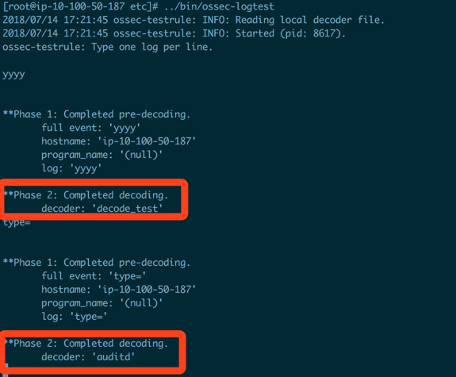

# 编写ossec decode

OSSEC 之所以产生报警，就是由于抓到了信息后由DECODE对信息进行解码，然后匹配规则（rule）进行相关告警产生ALERTID

会编写DECODE会对使用OSSEC 有很大的帮助。 这里会要用到OSSEC的一个测试命令 ossec-logtest.

这里编写一个简单的规则，遇到lion\_00的时候，会产生一条ALERTID 为8888 严重度级别为7的报警信息。  
首先是创建一个规则,在/var/ossec/rule 下创建一个testrule.xml 内容为：

```text
<group name="localtest,">                               //每一组rule 都要有group
<rule id="8888" level="7">
    <decoded_as>lion</decoded_as>                    //使用一个叫lion的decode 
    <description>testrule</description>                  //产生的告警信息
  </rule>
</group>
```

需要编写DECODE，在/var/ossec/etc/decoder.xml \(默认安装目录\)

```text
<decoder name="lion">                     //这里是不规范注释，decoder 名称 上面提到的lion
<prematch>^lion_00</prematch>            // 匹配的内容    如果是高级的DECODER 还会有很多参数   
</decoder>
```

需要说明的是，最好将自己的decode 放到文件稍微靠上的位置。

这个时候，使用 /var/ossec/bin/ossec-logtest 输入lion\_00 会看到

```text
**Phase 1: Completed pre-decoding.
       full event: 'lion_00'
       hostname: 'IDC2103'
       program_name: '(null)'
       log: 'lion_00'
**Phase 2: Completed decoding.
       decoder: 'lion'
**Phase 3: Completed filtering (rules).
       Rule id: '8888'
       Level: '7'
       Description: 'testrule'
**Alert to be generated.
```



可以使用这种方式编写自己的规则。

