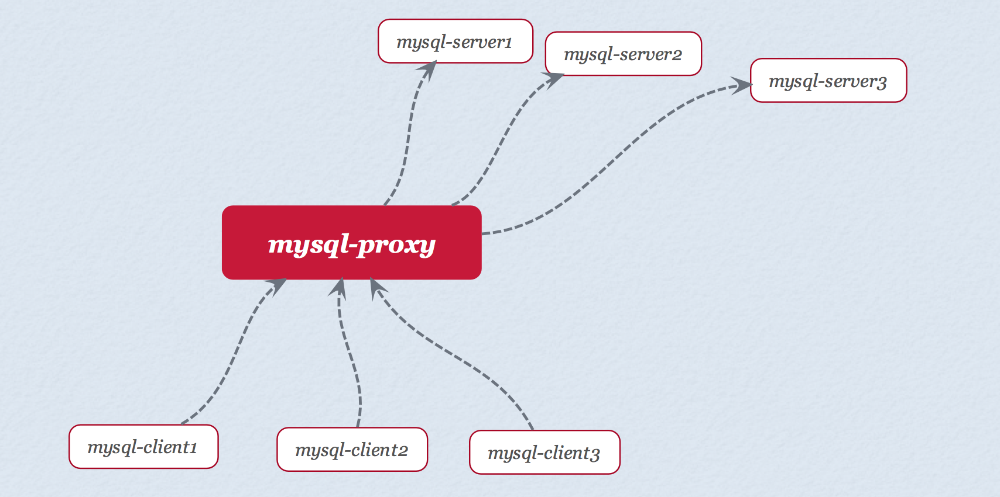
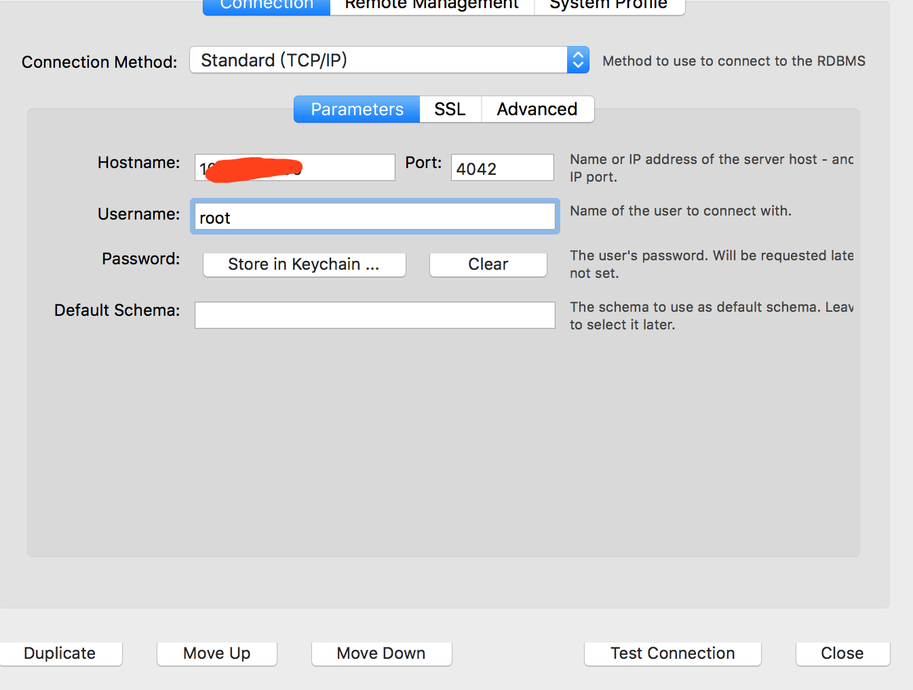
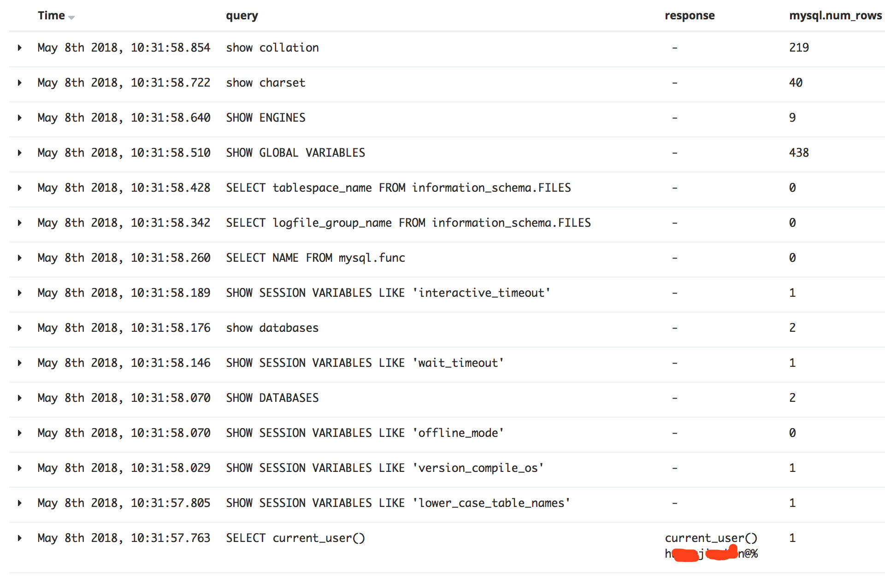
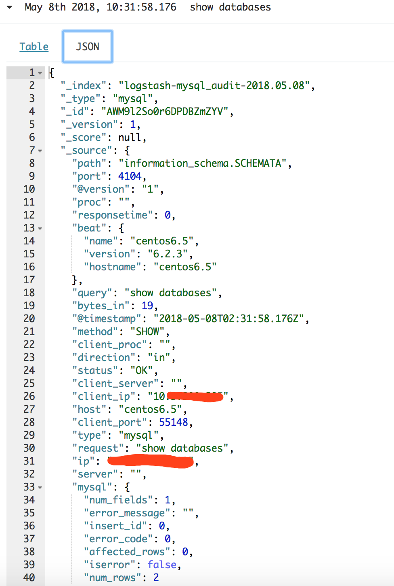

# mysql-proxy与packbeat+logstash搭建数据库审计

## 一、介绍

packbeat：

```text
 packbeat是一个开源的实时网络抓包与分析框架，内置了很多常见的协议捕获及解析，如HTTP、MySQL、Redis等。在实际使用中，通常和Elasticsearch以及kibana联合使用，用于数据搜索和分析以及数据展示。
```

mysql-proxy：

```text
 mysql-proxy是mysql官方提供的mysql中间件服务，上游可接入若干个mysql-client，后端可连接若干个mysql-server。它使用mysql协议，任何使用mysql-client的上游无需修改任何代码，即可迁移至mysql-proxy上。
```

工作示例：

我们这里是把packbeat和mysql-proxy都安装在同一台服务器上，连接mysql-server的流量都要经过mysql-proxy这一层进行转发（虽然它还有其他很强大的功能，这里只使用其转发功能），packbeat进行流量的审计功能，作为审计内部员工访问数据库的一种方法，性能应该不存在问题，毕竟并发不高。

## 二、mysql-proxy安装配置

安装基础包，因为mysql-proxy的逻辑处理需要lua脚本支持，所以要确定是否安装了lua

```text
yum -y install gcc* gcc-c++* autoconf* automake* zlib* libxml* ncurses-devel* libmc rypt* libtool* flex*  pkgconfig*
```

Mysql Proxy的安装

在[https://downloads.mysql.com/archives/proxy/](https://downloads.mysql.com/archives/proxy/) 这里选择对应的版本下载

解压安装

```text
cd /usr/local/software

tar -zxvf mysql-proxy-0.8.5-linux-el6-x86-64bit.tar.gz

cp mysql-proxy-0.8.5-linux-el6-x86-64bit /usr/local/mysql-proxy
```

授权

```text
chmod -R 775 /usr/local/mysql-proxy

chown -R mysql:mysql /usr/local/mysql-proxy
```

环境变量设置

```text
vim /etc/profile   //打开此文件，在文件尾部加上以下内容


LUA_PATH="/usr/local/mysql-proxy/share/doc/mysql-proxy/?.lua"    // lua环境变量的设置

export LUA_PATH

export PATH=$PATH:/usr/local/mysql-proxy/bin     //mysql proxy 环境变量的设置
```

保存并退出后执行下面命令

`source /etc/profile // 使变量立即生效`

修改mysql proxy的读写分离脚本的配置

```text
vim /usr/local/mysql-proxy/share/doc/mysql-proxy/rw-splitting.lua

默认最小4个(最大8个)以上的客户端连接才会实现读写分离, 现改为最小1个最大2个，便于读写分离的测试

-- connection pool

if not proxy.global.config.rwsplit then

   proxy.global.config.rwsplit = {

            min_idle_connections = 3000,  // 改为1

            max_idle_connections = 6000,  // 改为2


            is_debug = false

            }

    end
```

这是因为mysql-proxy会检测客户端连接, 当连接没有超过min\_idle\_connections预设值时,

不会进行读写分离, 即查询操作会发生到Master上。我这里由于只是需要它的转发功能，没有设置slave，所以把min\_idle\_connections设置了很大，不然超过了min\_idle\_connections这个值之后，它会去连负责读的slave，会导致连不上。

防火墙设置

```text
 vim /etc/sysconfig/iptables    //打开防火墙配置文件，加入以下内容

 -A INPUT -m state --state NEW -m tcp -p tcp --dport 4040 -j ACCEPT

 注：mysql-proxy的服务端口默认为4040
```

启动mysql-proxy

```text
vim /usr/local/mysql-proxy/mysql-proxy.sh   // 新建一个shell文件，加入以下内容


#!/bin/sh

mysql-proxy --daemon --log-level=debug --log-file=/var/log/mysql-proxy.log 

        --plugins=proxy -b 192.168.1.219:3306 -r 192.168.1.177:3306 

        --proxy-lua-script="/usr/local/mysql-proxy/share/doc/mysql-proxy/rw-splitting.lua" --plugins=admin

        --admin-username="test" --admin-password="321321" 

        --admin-lua-script="/usr/local/mysql-proxy/share/doc/mysql-proxy/admin.lua"


chmod 775 /usr/local/mysql-proxy/mysql-proxy.sh  // 授予执行权限

./mysql-proxy.sh   // 启动mysql-proxy
```

log-level=info \#定义log日志级别，由高到低分别有\(error\|warning\|info\|message\|debug\)

daemon=true \#以守护进程方式运行

keepalive=true \#mysql-proxy崩溃时，尝试重启

查看mysql-proxy服务端口

`netstat -tupln |grep mysql`

监控启动日志

`tail -f /var/log/mysql-proxy.log`

开启客户端连接

`mysql -h192.168.1.202 -P4040 -utest -p321321`

如果需要配置很多个mysql-server，按如下配置：

```text
mysql-proxy --daemon --log-level=message --log-file=/var/log/mysql-proxy.log --plugins=proxy --proxy-address=0.0.0.0:4042 --admin-address=0.0.0.0:4043 -b 10.110.4.78:3306 --proxy-lua-script="/usr/local/mysql-proxy/share/doc/mysql-proxy/rw-splitting.lua" --plugins=admin --admin-username="test" --admin-password="321321" --admin-lua-script="/usr/local/mysql-proxy/share/doc/mysql-proxy/admin.lua"

mysql-proxy --daemon --log-level=message --log-file=/var/log/mysql-proxy.log --plugins=proxy --proxy-address=0.0.0.0:4040 --admin-address=0.0.0.0:4041 -b 10.110.4.102:3306 --proxy-lua-script="/usr/local/mysql-proxy/share/doc/mysql-proxy/rw-splitting.lua" --plugins=admin --admin-username="test" --admin-password="321321" --admin-lua-script="/usr/local/mysql-proxy/share/doc/mysql-proxy/admin.lua"
```

防火墙也要相应的打开4040和4042这两个端口

分别通过4042和4040两个端口去连两个mysql



## 三、packbeat安装配置

官网下载：

`wget https://artifacts.elastic.co/downloads/beats/packetbeat/packetbeat-6.2.4-x86_64.rpm`

rpm方式直接安装

`rpm -ivh packetbeat-6.2.4-x86_64.rpm`

配置

```text
vi /etc/packetbeat/packetbeat.yml
主要配置mysql的配置项
- type: mysql
  # Configure the ports where to listen for MySQL traffic. You can disable
  # the MySQL protocol by commenting out the list of ports.
  send_request: true
  send_response: true
  max_rows: 10
  max_row_length: 1024
  enable: true
  ports: [4040，4042]


日志输出到logstash
output.logstash:
    #The Logstash hosts
    hosts: ["localhost:5044"]
    loadbalance: true
```

## 四、logstash配置

配置详情

```text
input {
    beats {
           port => 5044
     }
}

filter{

    if [query] != "SELECT current_user()"{
        mutate{
            remove_field =>["response"]
        }

    }
}

output{
      if [type]=="mysql" {
            elasticsearch {
                hosts => ["http:/"]
                user => ""
                password => ""
                index => "logstash-mysql_audit-%{+YYYY.MM.dd}"
       }

stdout{
      codec => rubydebug
   }
}
}
```

当查询语句是SELECT current\_user\(\)时，response会显示返回连接的用户，其他语句无需获取返回信息，避免泄露用户数据信息。

## 五、结果展示

把数据打到es里，然后kibana展示



## 六、mysql-router

也可使用mysql-router，这是mysql-proxy的一个升级版，相对来说mysql-router的配置更简单一些

安装步骤参考：[https://www.cnblogs.com/JiangLe/p/6626660.html](https://www.cnblogs.com/JiangLe/p/6626660.html)

[https://www.cnblogs.com/zengkefu/p/5499706.html](https://www.cnblogs.com/zengkefu/p/5499706.html)

配置示例

```
[DEFAULT]
logging_folder = /usr/local/mysql-router/log/
plugin_folder = /usr/local/mysql-router/lib/mysqlrouter/
runtime_folder = /usr/local/mysql-router/run/
config_folder = /usr/local/mysql-router/etc/

[logger]
level = DEBUG

[routing:testdb]
bind_address=0.0.0.0
bind_port = 4042
connect_timeout = 10
max_connections = 256
max_connect_errors = 1000
destinations = 127.0.0.1:3306
mode = read-only
ssl_mode=disabled     #需要设置这个,不然客户端使用ssl的方式进行连接，导致packetbeat抓不到包

[keepalive]
interval = 60
```

1、mysql-proxy如果代理很多的数据库经常会有一些代理掉线，需要配置脚本进行监控重启。

2、抓取mysql-router的数据包抓不到当前连接用户的包，但能够抓到连接的ip

mysql-router的官方文档：

[https://dev.mysql.com/doc/mysql-router/8.0/en/](https://dev.mysql.com/doc/mysql-router/8.0/en/)

