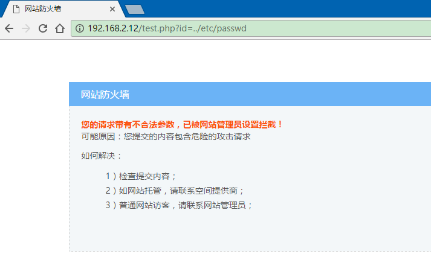
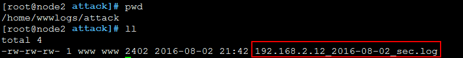
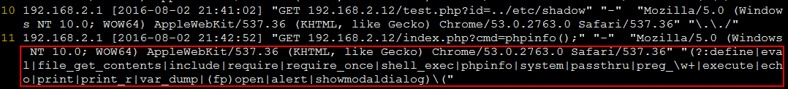

# nginx+lua实现简单的waf网页防火墙功能

## 安装LuaJIT

```text
http://luajit.org/download/LuaJIT-2.0.4.tar.gz

tar xf LuaJIT-2.0.4.tar.gz

cd LuaJIT-2.0.4

make &&make install 即可
```

最好使用2.1版本的

## 下载ngx\_devel\_kit

```text
https://codeload.github.com/simpl/ngx_devel_kit/zip/master
unzip ngx_devel_kit-master.zip
```

解压后的路径为：root/ngx\_devel\_kit-master

## 下载nginx\_lua\_module解压

```text
https://github.com/openresty/lua-nginx-module#readme

unzip lua-nginx-module-master.zip

cd lua-nginx-module-master
```

## 安装nginx或给nginx打补丁

```text
nginx -v 查看nginx的版本号
# nginx -v
nginx version: nginx/1.8.0
```

## nginx -V 查看以前的编译参数

```text
# nginx -V
nginx version: nginx/1.8.0
built by gcc 4.4.7 20120313 (Red Hat 4.4.7-16) (GCC) 
built with OpenSSL 1.0.1e-fips 11 Feb 2013
TLS SNI support enabled
configure arguments: --user=www --group=www --prefix=/usr/local/nginx --with-http_stub_status_module --with-http_ssl_module --with-http_spdy_module --with-http_gzip_static_module --with-ipv6 --with-http_sub_module --with-google_perftools_module
```

我这里已经安装过nginx1.8了。

那么下面就是给nginx打补丁的事情了。如下：

进到nginx1.8的源代码目录下。执行下面的一系列命令：

```text
# 导入环境变量，编译

# export LUAJIT_LIB=/usr/local/lib    #这个很有可能不一样

# export LUAJIT_INC=/usr/local/include/luajit-2.0 #这个很有可能不一样


# cd /home/tools/lnmp1.2-full/src/nginx-1.8.0

#./configure \

--user=www --group=www \

--prefix=/usr/local/nginx \

--with-http_stub_status_module \

--with-http_ssl_module \

--with-http_spdy_module \

--with-http_gzip_static_module \

--with-ipv6 \

--with-http_sub_module \

--with-google_perftools_module \

--add-module=/root/ngx_devel_kit-master\

--add-module=/root/lua-nginx-module-master\

--with-ld-opt="-Wl,-rpath,$LUAJIT_LIB"


# make -j4 && make install
```

## 准备nginx的攻击日志目录

```text
# mkdir -p /home/wwwlogs/attack

# chown www.www /home/wwwlogs/attack

# chmod -R 755 /home/wwwlogs/attack
```

## 安装nginx的Lua\_waf模块

官方地址：[https://github.com/loveshell/ngx\_lua\_waf](https://github.com/loveshell/ngx_lua_waf)

```text
# wget https://codeload.github.com/loveshell/ngx_lua_waf/zip/master

# unzip ngx_lua_waf-master.zip

# cd ngx_lua_waf-master

# mkdir /usr/local/nginx/conf/waf

# cp -a ./ /usr/local/nginx/conf/waf
```

修改nginx的配置文件，在http段加入如下内容：

```text
    lua_package_path"/usr/local/nginx/conf/waf/?.lua";

    lua_shared_dict limit 10m;  #开启拦截cc攻击必须加这条规则

   init_by_lua_file /usr/local/nginx/conf/waf/init.lua;

   access_by_lua_file /usr/local/nginx/conf/waf/waf.lua;
```

修改/usr/local/nginx/conf/waf/config.lua中如下2部分内容即可：

```text
RulePath ="/usr/local/nginx/conf/waf/wafconf/"

attacklog = "on"

logdir ="/home/wwwlogs/attack"

UrlDeny="on"

Redirect="on"

CookieMatch="on"

postMatch="on"

whiteModule="on"

black_fileExt={"php","jsp"}

ipWhitelist={"127.0.0.1"}

ipBlocklist={"1.0.0.1"}

CCDeny="on"

CCrate="100/60"


配置文件说明：

    RulePath = "/usr/local/nginx/conf/waf/wafconf/"    --规则存放目录

    attacklog = "off"               --是否开启攻击信息记录，需要配置logdir

    logdir ="/usr/local/nginx/logs/hack/"   --log存储目录，该目录需要用户自己新建，需要nginx用户的可写权限

    UrlDeny="on"                    --是否拦截url访问

    Redirect="on"                   --是否拦截后重定向

    CookieMatch = "on"              --是否拦截cookie攻击

    postMatch = "on"                --是否拦截post攻击

    whiteModule = "on"              --是否开启URL白名单

   black_fileExt={"php","jsp"}      --填写不允许上传文件后缀类型

    ipWhitelist={"127.0.0.1"}       --ip白名单，多个ip用逗号分隔

    ipBlocklist={"1.0.0.1"}          --ip黑名单，多个ip用逗号分隔

    CCDeny="on"           --是否开启拦截cc攻击(需要nginx.conf的http段增加lua_shared_dict limit 10m;)

    CCrate ="100/60"     --设置cc攻击频率，单位为秒. 默认1分钟同一个IP只能请求同一个地址100次

    html=[[Please go away~~]]       --警告内容,可在中括号内自定义

    备注:不要乱动双引号，区分大小写
```

## **重启nginx**

```text
# nginx -t

# /etc/init.d/nginx restart   重启nginx
```

## **恶意访问测试**

```text
# curl http://xxxx/test.php?id=../etc/passwd

# curl http://192.168.2.12/index.php?cmd=phpinfo();
```

或者直接在网页上请求

结果都是如下图所示，被拦截了。



此外，在/home/wwwlogs/attack目录下已经有日志文件记录下整个攻击的日志了。

一些说明：

过滤规则在wafconf下，可根据需求自行调整，每条规则需换行,或者用\|分割

* args里面的规则get参数进行过滤的
* url是只在get请求url过滤的规则
* post是只在post请求过滤的规则
* whitelist是白名单，里面的url匹配到不做过滤
* user-agent是对user-agent的过滤规则

默认开启了get和post过滤，需要开启cookie过滤的，编辑waf.lua取消部分–注释即可。

拦截到的非法请求，记录在日志文件名称格式如下:虚拟主机名\_sec.log

说明：

这玩意貌似只能防止一些简单的sql注入类的语句，对于一些精心构造的恶意语句还是拦截不了的。

另外，我在公司的服务器上装了它，后台客服反应会出现form表单中图片无法上传的情况。

